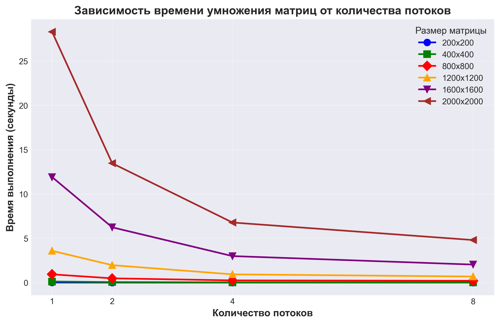

# Лабораторная работа №2

## 1. Задание:
Модифицировать программу из л/р №1 для параллельной работы по технологии OpenMP.
- Провести эксперименты с разным количеством потоков (1, 2, 4, 8)
- Разные размеры матриц (200, 400, 800, 1200, 1600, 2000)

## 2. Программа:
- `parall prog 2 lab.cpp` - параллельное умножение матриц (OpenMP)

## 3. Эксперименты

4 вычислительных ядер, количество потоков: 1, 2, 4, 8
### Время выполнения (секунды)

Размер    | 1 поток   | 2 потока  | 4 потока  | 8 потоков
----------|-----------|-----------|-----------|----------
200x200   | 0.0121442 | 0.0076721 | 0.0048096 | 0.0067995
400x400   | 0.121742  | 0.0554481 | 0.0295578 | 0.0326171
800x800   | 0.932688  | 0.481445  | 0.248648  | 0.203161
1200x1200 | 3.58543   | 1.96898   | 0.931847  | 0.685544
1600x1600 | 11.9108   | 6.23707   | 2.99097   | 2.03322
2000x2000 | 28.2996   | 13.4648   | 6.77972   | 4.80276

## 4. Выводы
- Увеличение количества потоков значительно сокращает время вычислений
- Наибольший эффект от параллелизации наблюдается на больших матрицах
- Верификация подтверждает корректность всех вычислений
